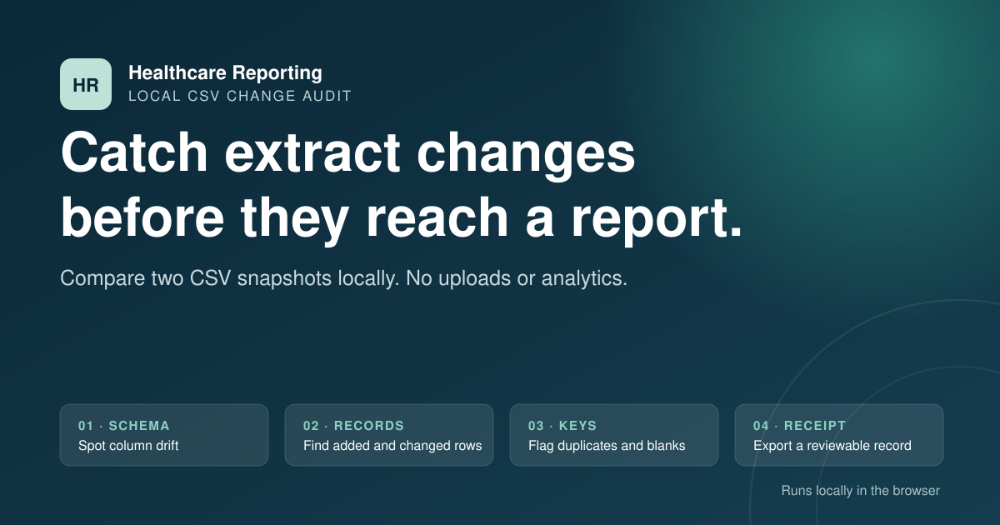

# Healthcare Reporting Toolkit

[](https://github.com/dfrbagley-cpu/healthcare-reporting-toolkit/actions/workflows/ci.yml)
[](https://github.com/dfrbagley-cpu/healthcare-reporting-toolkit/actions/workflows/pages.yml)
[](LICENSE)

Open, browser-based tools for common healthcare operational reporting tasks.

**Live toolkit:** <https://dfrbagley-cpu.github.io/healthcare-reporting-toolkit/>

[](https://dfrbagley-cpu.github.io/healthcare-reporting-toolkit/)

## What is included

| Tool | Question it answers | Output |
|---|---|---|
| Reporting Window Builder | What exact current and comparison dates should this report use? | Inclusive fiscal, rolling, custom, and like-for-like periods |
| Extract Change Auditor | What changed between two CSV snapshots? | Schema drift, added/removed/changed records, key warnings, and a change log |
| Waitlist Capacity Planner | What happens to backlog if demand and capacity continue at these rates? | Current-versus-planned trajectory, wait proxy, and required-capacity estimate |

The project deliberately avoids authentication, telemetry, remote storage,
vendor-specific schemas, and opaque scoring. It is a small, inspectable toolkit,
not a hosted reporting platform.

## Use it

Open the [live toolkit](https://dfrbagley-cpu.github.io/healthcare-reporting-toolkit/)
in a modern browser. There is no installation or account.

To run a local copy:

```bash
python3 -m http.server 8000 --directory site
```

Then open `http://localhost:8000`.

## Privacy and security

- The site is static and has no backend.
- CSV files are parsed on the user's device.
- The published site makes no API, analytics, font, or asset requests to third parties.
- A restrictive Content Security Policy disables network connections from the application.
- Downloaded CSV change logs protect leading spreadsheet-formula characters.
- Duplicate and missing record keys are excluded rather than guessed.
- Extract analysis receipts contain source fingerprints and aggregate findings,
  but omit filenames, column names, row keys, and cell values.

These controls do not override an organization's privacy, retention, security,
or approved-software policies. Inspect and approve the code and deployment
before using a local copy with sensitive information.

## Analysis receipts

Every tool can download a versioned JSON analysis receipt. A receipt records
the normalized inputs, aggregate outputs, warnings, calculation assumptions,
toolkit version, and a deterministic calculation digest. The public
[JSON Schema](site/schemas/analysis-receipt.schema.json) defines the contract.

For extract audits, SHA-256 fingerprints are calculated from the original file
bytes in the browser. The receipt includes those fingerprints plus file size,
row count, and column count; it deliberately excludes filenames, headers,
record keys, and cell values. The ordered key-column choice is represented by
its own fingerprint so a configuration change produces a different calculation
digest without exposing the column names. The separate change-log CSV does
contain row-level differences and must be handled according to the source
data's sensitivity.

A receipt and its hashes support repeatability; they do not prove source
accuracy, authorship, approval, or when a calculation occurred. Review a
receipt before sharing it because even aggregate metadata can be sensitive.

## Calculation boundaries

The tools are decision support:

- Reporting periods use calendar dates and inclusive boundaries. They do not
  implement 4-4-5 calendars, holiday calendars, or organization-specific exclusions.
- Extract values are compared as text. Inferred type changes are screening
  signals, not a formal schema. Inputs must be UTF-8 comma-delimited CSV.
- The waitlist planner uses a deterministic fluid-queue approximation with
  constant average arrivals and capacity. It is not a patient-level prediction,
  discrete-event simulation, or clinical prioritization model. Its recommended
  capacity is the larger of the amount needed to meet the selected horizon
  target and the steady-state floor implied by average arrivals.

Every material assumption is repeated beside the relevant tool.

## Development

The site uses plain HTML, CSS, and JavaScript modules with no runtime or
development dependencies. Node.js 20 or later is needed only for validation.

```bash
npm test
npm run check
npm run validate
```

`npm run validate` runs deterministic domain tests, syntax checks, interface
integrity checks, privacy-boundary checks, and network-primitive checks.

## Project structure

```text
site/
  index.html                  Public application
  styles.css                  Responsive visual system
  js/lib/                     Date, CSV, receipt, and hashing utilities
  js/tools/                   Pure calculation modules
  js/app.js                   Browser interface
  examples/                   Synthetic CSV snapshots
  schemas/                    Published analysis-receipt JSON Schema
tests/                        Deterministic unit tests
scripts/validate-site.mjs     Static and boundary validation
.github/workflows/            CI and GitHub Pages deployment
```

## Related project

[Health Data Edge Cases](https://github.com/dfrbagley-cpu/health-data-edge-cases)
provides deterministic synthetic test cases for operational reporting logic.
The toolkit focuses on small, interactive utilities; the edge-case repository
focuses on implementation conformance.

## Contributing and licence

See [CONTRIBUTING.md](CONTRIBUTING.md) for the synthetic-data and scope
boundaries. The code is licensed under [Apache License 2.0](LICENSE).

Created and maintained by [David Bagley](https://github.com/dfrbagley-cpu).
