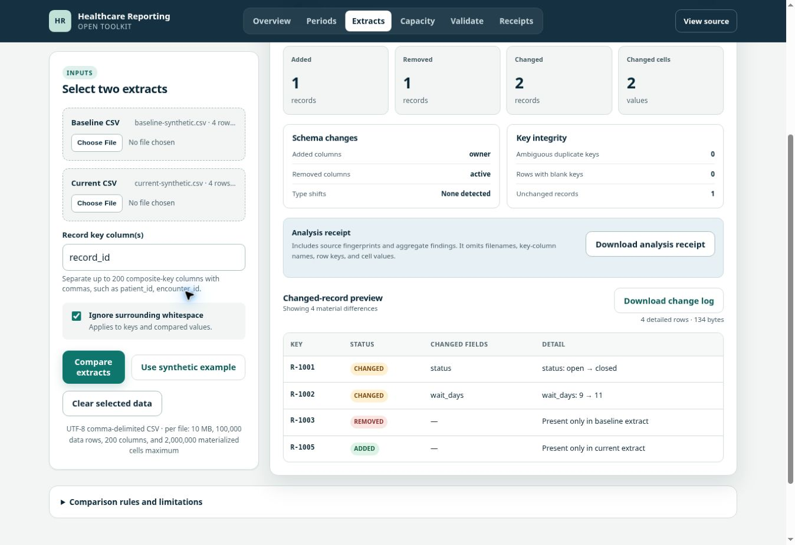

# Healthcare Reporting Toolkit

[](https://github.com/dfrbagley-cpu/healthcare-reporting-toolkit/actions/workflows/ci.yml)
[](LICENSE)

**Find changed records and schema drift before they reach a report.**
Compare two CSV extracts in your browser, inspect the differences, and export a
reviewable change log. Companion tools handle reporting dates, capacity
scenarios, result validation, and analysis receipts.

**[Try the live toolkit](https://dfrbagley-cpu.github.io/healthcare-reporting-toolkit/#auditor)**
· [Product case study](docs/CASE_STUDY.md)
· [Contribute](CONTRIBUTING.md)
· [Download a versioned release](https://github.com/dfrbagley-cpu/healthcare-reporting-toolkit/releases)

No installation, account, or upload. The application processes selected files
on your device and has no backend, telemetry, or third-party asset requests.

[](https://dfrbagley-cpu.github.io/healthcare-reporting-toolkit/#auditor)

## Repeat a monthly reporting check

[Open the monthly report check](https://dfrbagley-cpu.github.io/healthcare-reporting-toolkit/report-check.html)
to save a profile, check local CSV snapshots, and account for a changed eligible
event count. Start with the clean and invalid examples.
[Read the walkthrough and boundaries](docs/MONTHLY_REPORT_CHECK.md).

## See a useful result in 60 seconds

1. Open the [Extract Change Auditor](https://dfrbagley-cpu.github.io/healthcare-reporting-toolkit/#auditor).
2. Select **Use synthetic example**. Leave the record key as `record_id`.
3. Check the result against the table below, then select **Download change log**.

| Expected finding | What changed |
|---|---|
| 1 added record | `R-1005` appears in the current extract |
| 1 removed record | `R-1003` appears only in the baseline |
| 2 changed records / 2 changed cells | `R-1001` status: `open` → `closed`; `R-1002` wait days: `9` → `11` |
| 1 unchanged record | `R-1004` has identical shared values |
| Separate schema changes | Column `owner` added; column `active` removed |

Both snapshots contain four rows. **A row-count check alone would miss these
changes.** The [walkthrough](docs/EXTRACT_AUDITOR.md) explains how to interpret
the differences and choose between a detailed CSV and an aggregate receipt.

## Choose a tool

| You need to… | Open | What you get |
|---|---|---|
| Compare two CSV snapshots | [Extract Change Auditor](https://dfrbagley-cpu.github.io/healthcare-reporting-toolkit/#auditor) | Schema drift, record differences, key warnings, and change-log export |
| Make reporting dates explicit | [Reporting Window Builder](https://dfrbagley-cpu.github.io/healthcare-reporting-toolkit/#windows) | Inclusive fiscal, rolling, custom, and like-for-like periods |
| Assess a capacity change | [Waitlist Capacity Planner](https://dfrbagley-cpu.github.io/healthcare-reporting-toolkit/#capacity) | Current and planned backlog trajectories with stated assumptions |
| Test aggregate reporting outputs | [Reporting Results Checker](https://dfrbagley-cpu.github.io/healthcare-reporting-toolkit/#validate) | Exact mismatches against a bundled synthetic contract |
| Check a saved calculation record | [Receipt Inspector and Replay](https://dfrbagley-cpu.github.io/healthcare-reporting-toolkit/#receipts) | Profile validation, digest checks, supported replay, and optional file matching |

## What is verified—and what is not

The [quality gates](https://github.com/dfrbagley-cpu/healthcare-reporting-toolkit/actions/workflows/ci.yml)
run deterministic calculation and receipt tests. The Chrome suite exercises all
five browser experiences, WCAG 2 A/AA automated checks, and a 100,000-row extract
comparison with cancellation, responsive interaction, and bounded output.

This is independent software with synthetic examples. These checks demonstrate
defined behavior; they do not establish hospital approval, clinical safety,
production adoption, or full accessibility conformance. Read the
[product decisions and evidence](docs/CASE_STUDY.md).

## Use your own files or host a copy

Extracts must be UTF-8 comma-delimited CSV with key columns present in both
files. Values are compared as text. Each file is limited to 10 MB, 100,000 rows,
200 columns, and 2,000,000 materialized cells. Duplicate and blank keys are
excluded with warnings, not guessed. The preview is bounded; a complete CSV
download is refused if its documented output limits are exceeded.

Use your organization's approved software and data-handling process before
selecting sensitive files. Detailed change logs contain source values; receipts
omit filenames, headers, record keys, and cell values but can still contain
sensitive aggregate metadata. See [privacy and calculation limits](docs/TECHNICAL_REFERENCE.md).

For an approved internal deployment, download the self-host ZIP, provenance
JSON, and `SHA256SUMS` from the **same versioned release**, verify the hashes,
and follow [INTERNAL_DEPLOYMENT.md](INTERNAL_DEPLOYMENT.md). Use a tested release
instead of the moving `main` branch for operational deployments.

For a local development preview:

```bash
git clone https://github.com/dfrbagley-cpu/healthcare-reporting-toolkit.git
cd healthcare-reporting-toolkit
python3 -m http.server 8000 --directory site
```

Open `http://localhost:8000`. The site has no runtime dependencies or build step.

## Help improve a real workflow

Try the synthetic audit, then [report a reproducible problem or share a workflow](https://github.com/dfrbagley-cpu/healthcare-reporting-toolkit/issues/new/choose).
Tell us what you expected, what happened, and what would make the result useful.
Use independently authored synthetic examples only; never include patient,
employer-confidential, licensed-standard, or vendor-proprietary material.

New contributors can start with a [composite-key tutorial or browser walkthrough](CONTRIBUTING.md#small-contributions-to-start-with).
Small documentation fixes can go straight to a pull request. Calculation changes
should include a minimal example and expected result. See
[CONTRIBUTING.md](CONTRIBUTING.md) for setup and verification commands.

## More detail

- [Extract audit walkthrough](docs/EXTRACT_AUDITOR.md)
- [Results checker: fail → diagnose → correct](docs/CONFORMANCE_CHECKER.md)
- [Receipt inspection and replay](docs/RECEIPT_INSPECTOR.md)
- [Technical reference: privacy, receipt contracts, limits, and structure](docs/TECHNICAL_REFERENCE.md)
- [Release history](CHANGELOG.md) · [Security](SECURITY.md) · [Publication policy](PUBLICATION_POLICY.md)

The companion [Health Data Edge Cases](https://github.com/dfrbagley-cpu/health-data-edge-cases)
owns the synthetic fixtures and expected-result contracts. This toolkit consumes
its pinned, digest-verified public catalogue; it does not duplicate the rules.

Created and maintained by [David Bagley](https://github.com/dfrbagley-cpu).
AI-assisted implementation; product direction, domain decisions, and validation
remain the maintainer's responsibility. Licensed under [Apache 2.0](LICENSE).
